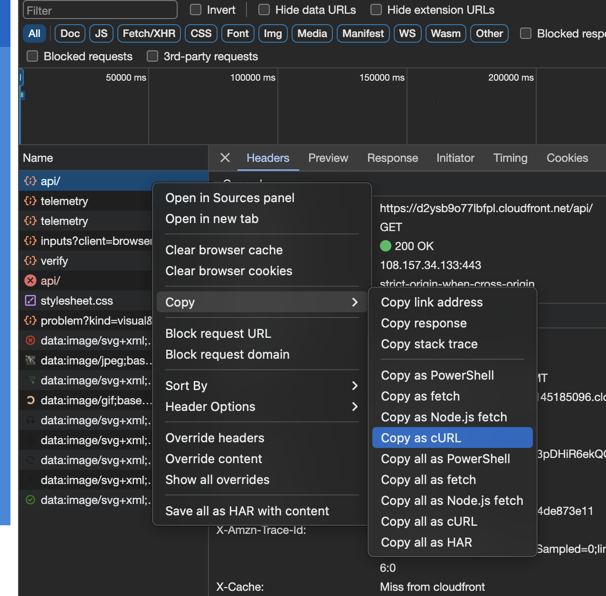
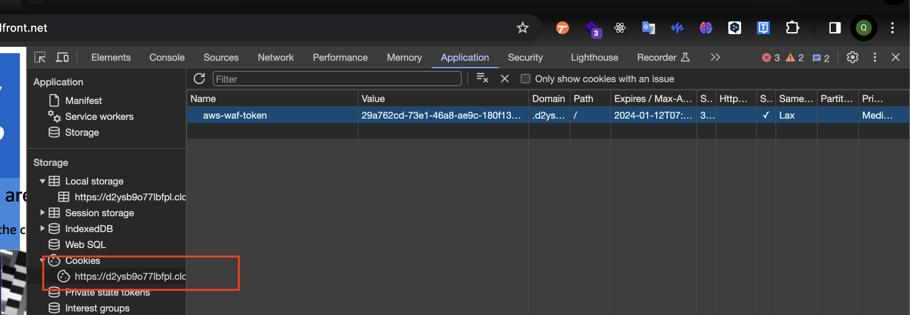
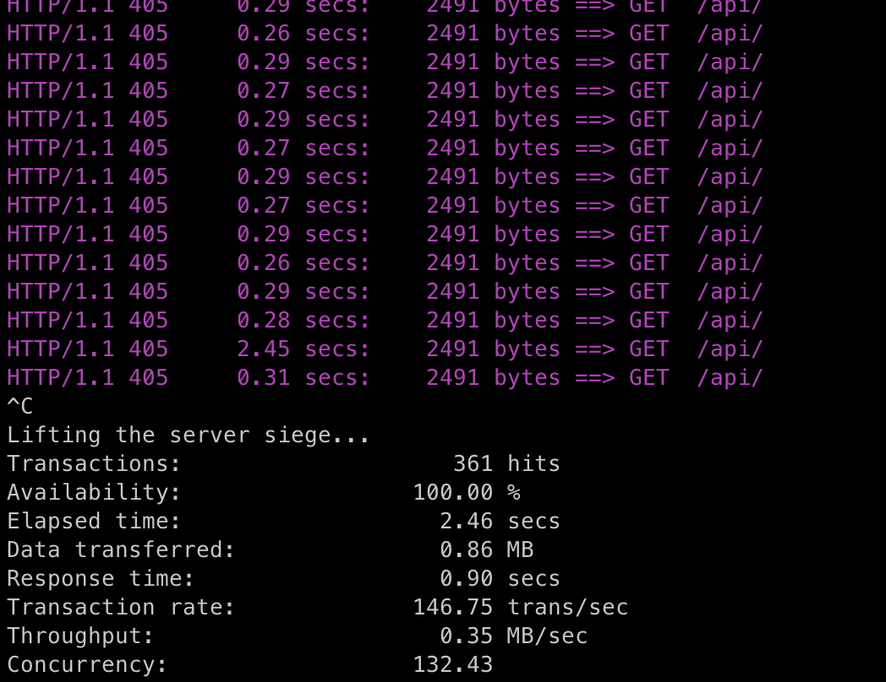
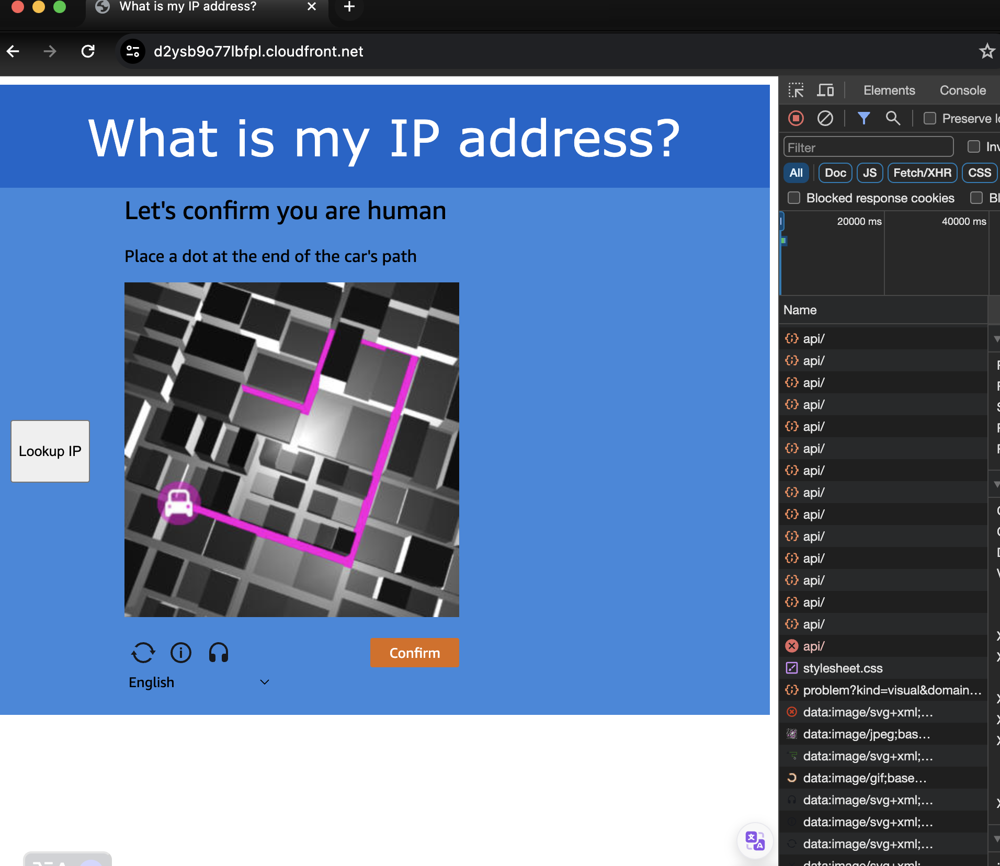
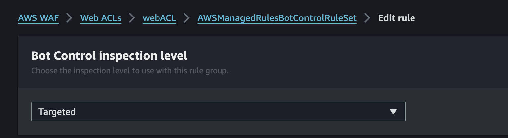
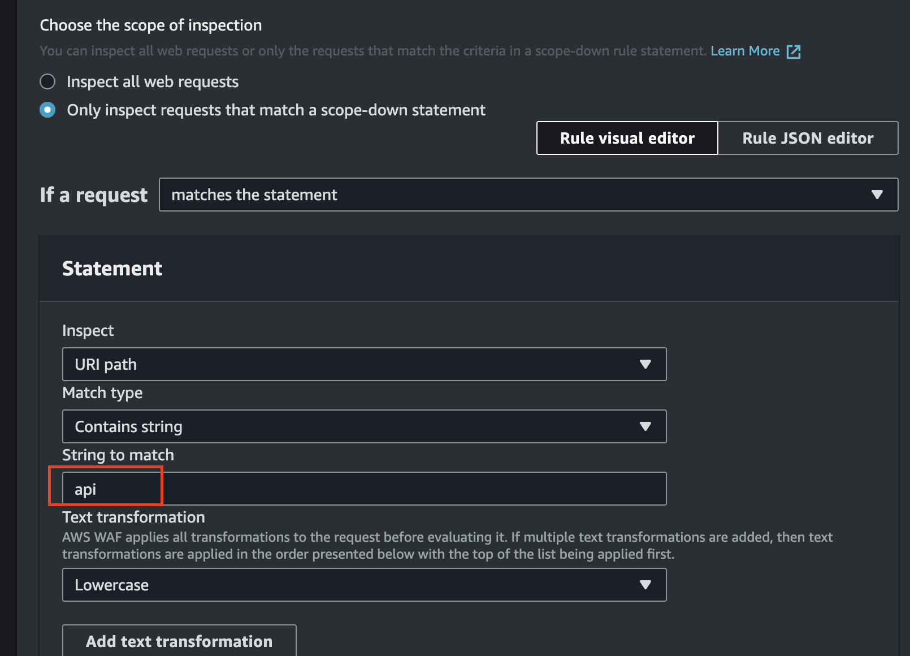
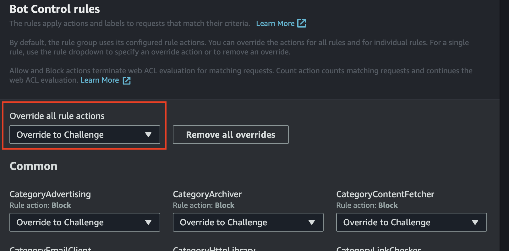
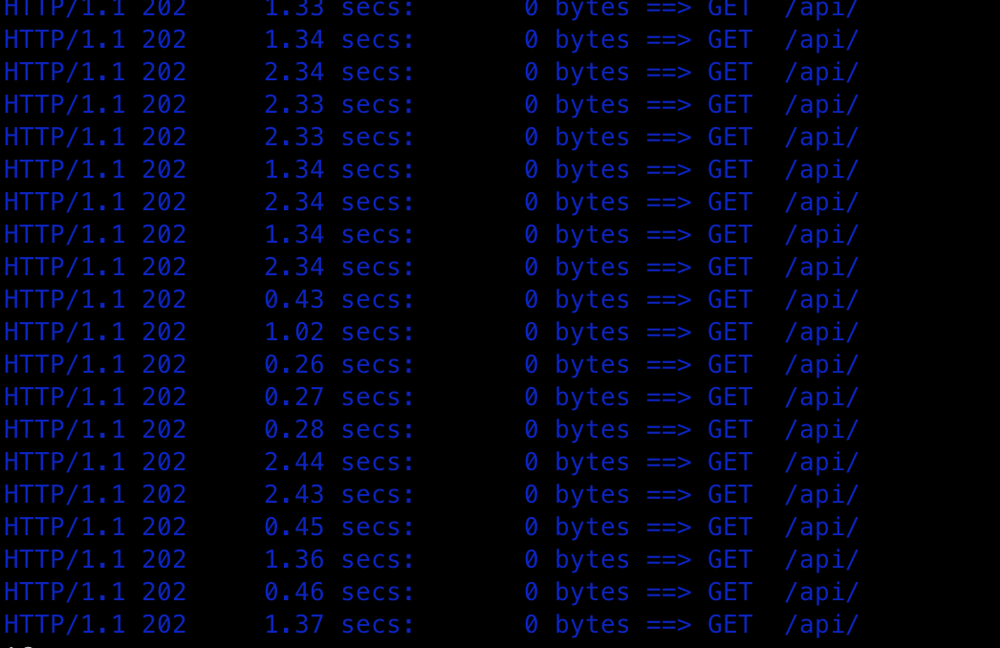
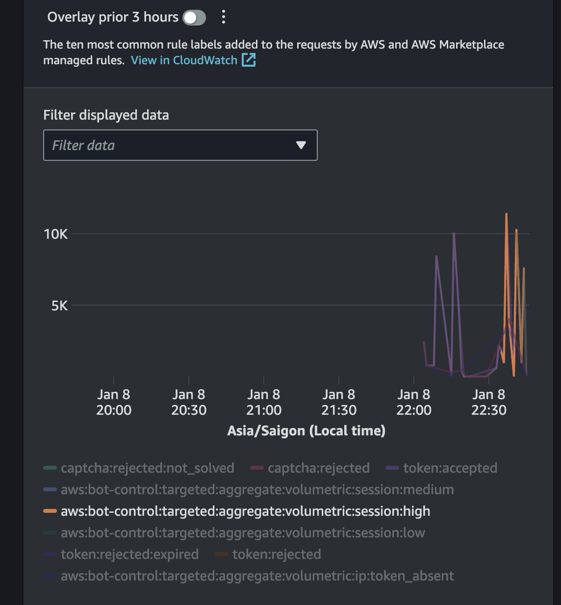

# BOT CONTROL 
This guideline will leverage aws samples git repo for cdk deployment and we'll go through 2 mode:
- Captcha - http status code 405 
- Challenge - http status code 202

## 1. Installation
Pls refer to this link. Pls use region **us-east-1** for this deployment. Why ? Because we will use the cloudfront and waf bot control will apply on cloudfront with **Global** level so that's why us-east-1 will be used in this deployment. For how to deploy on **ap-southeast-1** and waf apply on global/ us-east-1. Pls refer the terraform folder to see.
- [aws waf bot control api protection with captcha](https://github.com/aws-samples/aws-waf-bot-control-api-protection-with-captcha.git)

## 2. Check the Captcha with Load test
We'll use the **curl** command in conjunction with **siege** command
### 2.1. Get the curl command from chrome


### 2.2. Use the command siege after get the curl
For example
Note: -c is concurrent and we'll use 200 concurrent api calls with **-c 200**
```bash
siege -c 200 curl 'https://d2ysb9o77lbfpl.cloudfront.net/api/' \
  -H 'authority: d2ysb9o77lbfpl.cloudfront.net' \
  -H 'accept: */*' \
  -H 'accept-language: vi' \
  -H 'cache-control: no-cache' \
  -H 'cookie: aws-waf-token=29a762cd-73e1-46a8-ae9c-180f13552f4f:BgoAhQs1SDkGAAAA:hi0xkZnQHPmbZK6gDUEY3C2P4kIxZ70M5nocBGKS7Q5B0p7kKfTFDtKGgNxp+NZlh1Y+qQesmsx9fauSykhADhjN75i/EHBW5zP0Ocu+FBtle7xquXm7AijRsiZSaur0wujo/oCcyeggHF4j76Ib6Ayjkw+sov3jYQoN1lBDfCHQ1OTz9BZuDkxV8dWlXQ9MB8zuRyO7Hev8hQ5tnNzvGviFYuOMW4mUsa3XsAjQUPHrt/AmzWtdKqLluskS3WX9BaoqQ7P8' \
  -H 'pragma: no-cache' \
  -H 'referer: https://d2ysb9o77lbfpl.cloudfront.net/' \
  -H 'sec-ch-ua: "Not_A Brand";v="8", "Chromium";v="120", "Google Chrome";v="120"' \
  -H 'sec-ch-ua-mobile: ?0' \
  -H 'sec-ch-ua-platform: "macOS"' \
  -H 'sec-fetch-dest: empty' \
  -H 'sec-fetch-mode: cors' \
  -H 'sec-fetch-site: same-origin' \
  -H 'user-agent: Mozilla/5.0 (Macintosh; Intel Mac OS X 10_15_7) AppleWebKit/537.36 (KHTML, like Gecko) Chrome/120.0.0.0 Safari/537.36' \
  --compressed
```

Pls note: you can see the **cookie** with **aws-waf-token** with above curl:
```bash
cookie: aws-waf-token=29a762cd-73e1-46a8-ae9c-180f13552f4f:BgoAhQs1SDkGAAAA:hi0xkZnQHPmbZK6gDUEY3C2P4kIxZ70M5nocBGKS7Q5B0p7kKfTFDtKGgNxp+NZlh1Y+qQesmsx9fauSykhADhjN75i/EHBW5zP0Ocu+FBtle7xquXm7AijRsiZSaur0wujo/oCcyeggHF4j76Ib6Ayjkw+sov3jYQoN1lBDfCHQ1OTz9BZuDkxV8dWlXQ9MB8zuRyO7Hev8hQ5tnNzvGviFYuOMW4mUsa3XsAjQUPHrt/AmzWtdKqLluskS3WX9BaoqQ7P8' 
```

We can check the cookie & token information such as expiration date


### 2.3. Check the result after run siege command on terminal
You will receive the http status code 405


### 2.4. Handle http status code 405 with captcha
Check the folder ***html*** which contains ***spa.html*** in this [repo](https://github.com/aws-samples/aws-waf-bot-control-api-protection-with-captcha.git) you will see the function that handle http status code 405 and ***showMyCaptcha***
```javascript
    function userAction() {
    const container = document.getElementById('container');
    container.innerHTML = '';
    AwsWafIntegration.fetch(apiURL,{}).then(response => {
        if (response.status == 405) {
            showMyCaptcha();
        }
        else {
            response.json().then(myJson => { renderResponse(myJson) });
        }
    });
}
```
Then we back to check on the browser, then we'll see the captcha pop-up. Try to finish captcha

## 3. Check the `Challenge` mode
We keep almost the same as above but some changes
### 3.1. Change the bot control inspection level
Go to the ***AWS WAF -> Web ACLs -> webACL -> AWSManagedRulesBotControlRuleSet*** and edit rule

You can see the ***string to match*** to match the api call on browser

then change all rule actions to `challeng` mode


After finish all, we'll do steps again:
- Copy `curl` from chrome 
- Use `siege` with curl
- Then check the result on terminal
  

Then we go to the `traffic dashboard` to see the result

you can see the `volumetric:session:high`

